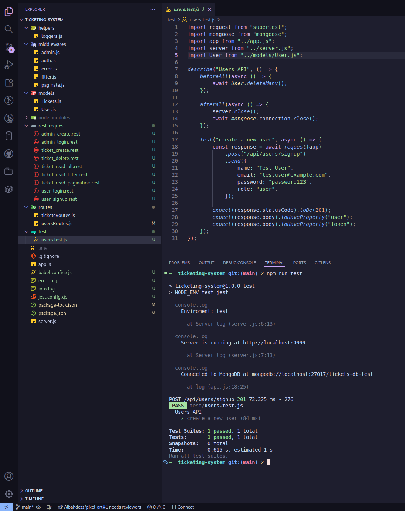
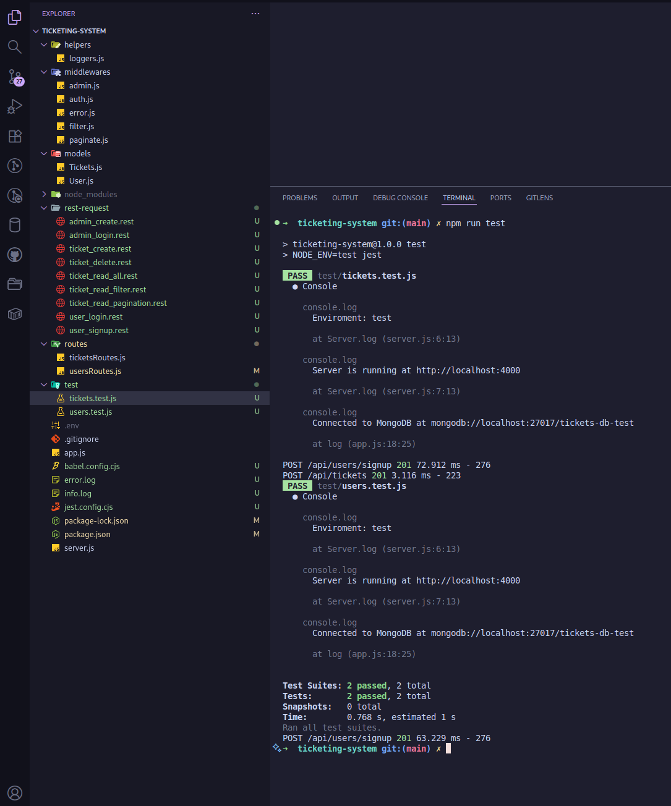
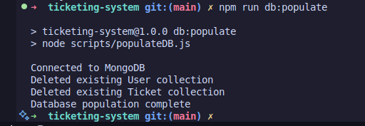

# Ticketing System

A simple, extensible ticketing system API built with Node.js, Express and MongoDB. Intended as a small project for learning REST APIs, authentication (JWT), pagination/filters and best-practice middleware (security, logging, rate limiting).

## Primary features
- User signup & login (JWT authentication)
- Create, read, update, delete tickets
- Pagination and filtering for ticket listing
- Password hashing and user roles (user/admin)
- Tests with Jest + Supertest
- DB population script for development and demos

## Tech stack
- Node.js (ES modules)
- Express
- MongoDB (Mongoose)
- JWT for authentication
- bcryptjs for password hashing
- Jest + Supertest for tests

## Repository layout

- `app.js` - Express app configuration, middleware and route mounting
- `server.js` - Application entry point that starts the HTTP server
- `routes/` - Route handlers (`usersRoutes.js`, `ticketsRoutes.js`)
- `models/` - Mongoose models (`User.js`, `Tickets.js`)
- `middlewares/` - Middlewares (auth, admin, paginate, filter, error handling)
- `helpers/` - Helper utilities (rate limiting, etc.)
- `scripts/populateDB.js` - Script to seed the local database with demo data
- `test/` - Jest + Supertest integration tests




## Prerequisites

- Node.js >= v18 (project uses modern ES modules and Node features)
- A running MongoDB instance (local or remote)

## Environment variables
Create a `.env` file in project root (example values):

```
PORT=4000
NODE_ENV=dev
DB_URL=mongodb://localhost:27017/tickets-db
JWT_SECRET=your_jwt_secret_here
```

Notes:
- When `NODE_ENV=test` the app connects to `mongodb://localhost:27017/tickets-db-test` automatically.
- `PORT` defaults to `3000` if not set.

## Installation

Clone the repository and install dependencies:

```bash
git clone <repo-url>
cd ticketing-system
npm install
```

## Available npm scripts

- `npm run start` – start in production mode (NODE_ENV=prod)
- `npm run dev` – start in development mode with `node --watch` (NODE_ENV=dev)
- `npm run test` – run test suite (NODE_ENV=test)
- `npm run db:populate` – run the DB seeder script to populate demo users and tickets

## Running locally

1. Ensure MongoDB is running locally (or point `DB_URL` to your MongoDB server).
2. Create a `.env` with the values mentioned above.
3. Run the app in dev mode:

```bash
npm run dev
```

Open http://localhost:3000/ (or the port you set) to verify the server responds.

## API overview

Base path: `/api`

Auth headers: `Authorization: Bearer <token>`

### Users
- `POST /api/users/signup` - Register a new user. Body: `{ name, email, password, role (optional) }`. Returns `{ user, token }` and sets `Authorization` header.
- `POST /api/users/login` - Login. Body: `{ email, password }`. Returns `{ token }` and sets `Authorization` header.

### Tickets
- `GET /api/tickets` - List tickets. Supports query params: `page`, `pageSize`, `status`, `priority`, `search`. Returns a paginated object (see `res.paginatedResults`).
- `GET /api/tickets/:id` - Get a single ticket by ID.
- `POST /api/tickets` - Create a ticket (requires auth). Body: `{ title, description, priority, status }`.
- `PUT /api/tickets/:id` - Update (requires auth).
- `DELETE /api/tickets/:id` - Delete (requires admin + auth).

Refer to the route files in `routes/` for exact request/response shapes.

## Testing

Run the test suite (Jest + Supertest):

```bash
npm run test
```



Tests run with `NODE_ENV=test` and the app automatically uses the `tickets-db-test` database.

## Seeding demo data

To populate local DB with demo users and tickets, run:

```bash
npm run db:populate
```



This script will:
- Remove existing users and tickets collections
- Create a regular user and an admin user
- Insert 15 sample tickets

## Security & Best practices included

- Helmet for basic security headers
- CORS enabled
- Rate limiting helper ready to use in production
- Password hashing with `bcryptjs`
- JWT authentication
- Input validation and error handling (see `middlewares/`)

## Contributing

- Create a new branch for your feature/fix
- Add tests for new behavior
- Open a pull request with a clear description

---

## 👨‍💻 Contact

    Emiliano Perez Paponi
    Full Stack Developer
    GitHub: @Emiliano-Blackbird
    Mail: EmilianoPerezPaponi@gmail.com